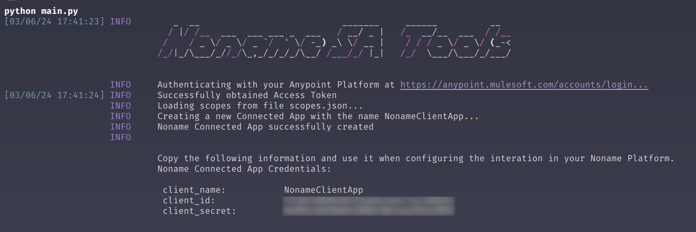
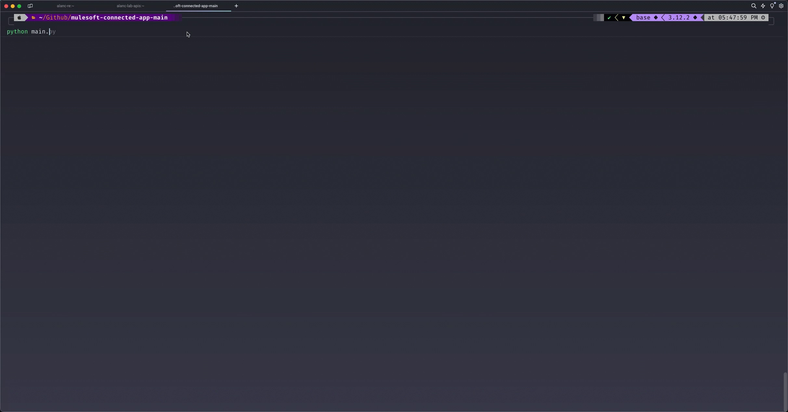
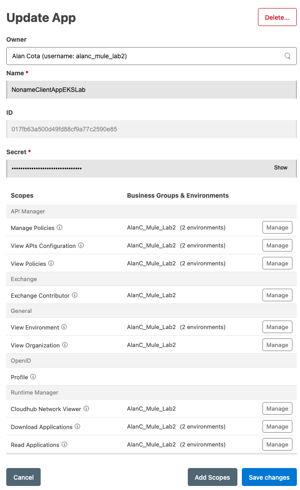

# Noname Platform + MuleSoft Anypoint Platform

## What is it?

Simple Python script that will create a [Connected Application](https://docs.mulesoft.com/access-management/connected-apps-overview) in Anypoint. That app will be used when configuring Noname to ingest API traffic from MuleSoft.

## Disclaimer

This is a personal project and it's not a supported Noname product.

## Why did I create this script?

I mean, why not? 😎


## Running the script

You are going to need Python3 to run the script. If you don't want to install Python3, then you can run the command using a Docker container.

### **Step 1**: clone the repository and `cd` into it

```bash
git clone https://github.com/alancota-noname/mulesoft-connected-app
cd mulesoft-connected-app
```

### **Step 2**: rename the `.env.example` to `.env` and open it with any text editor

```bash
mv .env.example .env
```

### **Step 3**: update the variables with **your** Anypoint information

```bash
# Add your Anypoint credentials
ANYPOINT_USERNAME=max_the_mule
ANYPOINT_PASSWORD=your_password

# Add your Organization Ids separated by comma
ANYPOINT_ORG_ID=9bc61119-70b9-44e6-81c3-f2a1a9aff8d0,1346c41d-5b17-430b-81b6-ab08072d92de

# Name of the Client App that will be created
NONAME_CLIENT_NAME=NonameClientApp
```

### **Step 4**: installing the Python dependencies

You can create a virtual environment or use Python via Docker. I'm using Python 3.12. All the commands must be executed from the folder where you cloned this script.

```bash
# Create a virtual environment
python -m venv .venv

# Activate it
source .venv/bin/activate

# Installing the packages
pip install -r requirements.txt
```

Here is a quick video of the step 4:
https://github.com/alancota-noname/mulesoft-connected-app/assets/147883780/8cca9057-f146-4296-b686-35159be4a97d

### **Step 5**: running the script

The script will execute the following tasks:

1. Login to Anypoint via HTTP API call and fetch an `access_token`
2. Load the `scopes` from the `scopes.json` file
3. Create a new Connected App by calling the Anypoint Accounts REST API
4. Print the new Connected App credentials

You should see a similar output if the script was able to create your new connected app:



Here is an example of the script in action:


It goes without saying that the client credentials shown above belongs to a test environment that no longer exists. =)

And here is the newly created app inside Anypoint Access Management:

